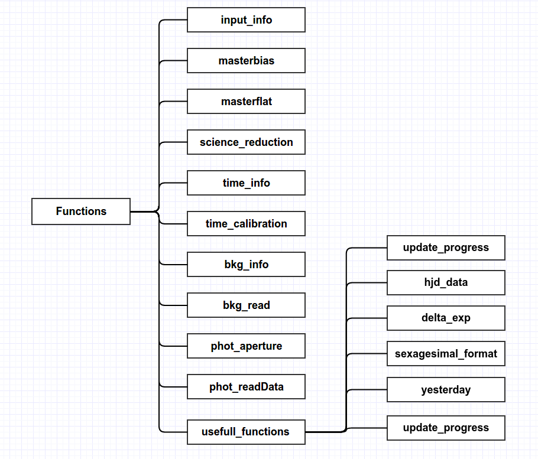

## ExoTRed
Exoplanetary Task Reduction, ExoTRed, is a python/pyraf package to reduce, calibrate and analysis data from observations of exoplanets.
___

## Functions:


___

## File Structure


___

## Installation:

Under astroconda environment (see more [here][astrconda] to install astroconda), do:

```python
python setup.py install
```

If you want to install astroconta environment on Ubuntu 16.04, you will need to install before some 32-libs to work properly:

```bash
sudo apt install libc6:i386 libz1:i386 libncurses5:i386 libbz2-1.0:i386 libuuid1:i386 libxcb1:i386 libxmu6:i386
```
and then, you will have to do a mkiraf to create a login.cl under your work directory, where will have your python script using this package.

___


<a rel="license" href="http://creativecommons.org/licenses/by/4.0/"></a><br />This work is licensed under a <a rel="license" href="http://creativecommons.org/licenses/by/4.0/">Creative Commons Attribution 4.0 International License</a>.


[astrconda]: http://astroconda.readthedocs.io/en/latest/]