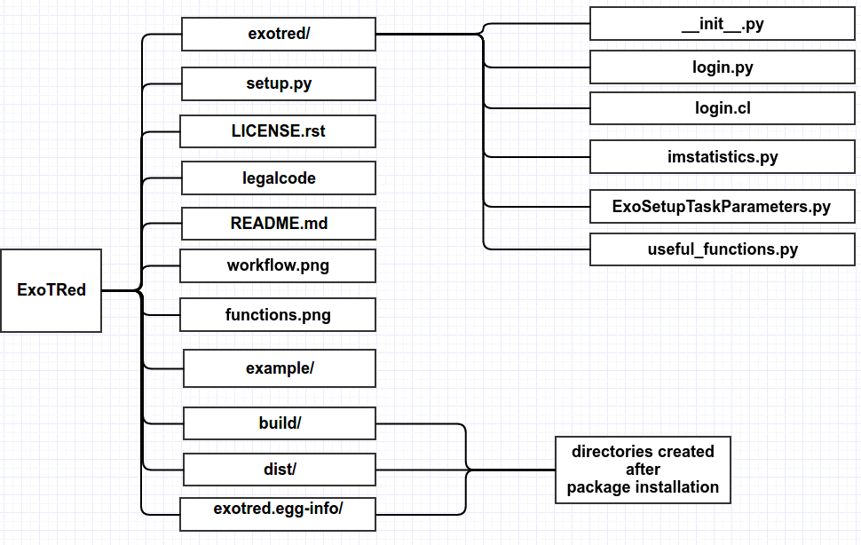

## ExoTRed
Exoplanetary Task Reduction, ExoTRed, is a python/pyraf package to reduce, calibrate and analysis data from observations of exoplanets.
___

## Functions:


(1) *input_info*: Obtain information about the files that will be reduced from the input*.yaml file.
(2) *masterbias*: Obtain the masterbias.fits image.
(3) *masterflat*: Obtain the masterflat image for calibration
(4) *science_reduction*: Calibrate science images with masterflat (or superflat) and masterbias (or superbias) images.
(5) *time_info*: Obtain the Sideral Time and the Heliocentric Jullian Date from the header of the images.
(6) *time_calibration*: Obtain the calibration for time (hjd) by pyraf and the airmass for each image. Include in the header all information.
(7) *bkg_info*: Obtain the sky backgound for each science image.
(8) *bkg_read*: Read the sky backgound files obtained by bkg_info routine and return the background mask and noise data.
(9) *phot_aperture*: Obtain the aperture photometry to the list of apertures in the input_file dictionary.
(10) *phot_readData*: Read the aperture photometry files and return the normalized flux, rawflux, of the exoplanet, with the error, eflux, the heliocentric julian date, hjd, and teh airmass.
(11) *usefull_functions*: sub-package
	11.1 *update_progress*: Progress Bar to visualize the status of a procedure
	11.2 *hjd_date*: Return the Heliocentric Julian Date from a given Julian Date
	11.3 *delta_exp*: Obtain the mean time of the exposure when the exposure is less than 1 minute
	11.4 *sexagesimal_format*: Return the angle number in sexagesimal format.
	11.5 *yesterday*: Return the previous day of the input given by the header on 'DATE-OBS'
___

## File Structure


___

## Installation:

Under astroconda environment (see more [here][astrconda] to install astroconda), do:

```python
python setup.py install
```

If you want to install astroconta environment on Ubuntu 16.04, you will need to install before some 32-libs to work properly:

```bash
sudo apt install libc6:i386 libz1:i386 libncurses5:i386 libbz2-1.0:i386 libuuid1:i386 libxcb1:i386 libxmu6:i386
```
and then, you will have to do a mkiraf to create a login.cl under your work directory, where will have your python script using this package.

___


<a rel="license" href="http://creativecommons.org/licenses/by/4.0/"></a><br />This work is licensed under a <a rel="license" href="http://creativecommons.org/licenses/by/4.0/">Creative Commons Attribution 4.0 International License</a>.


[astrconda]: http://astroconda.readthedocs.io/en/latest/]